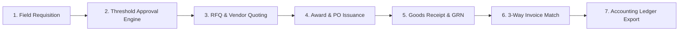

<div align="center">

# ⚡ Procurely Flow
### Enterprise Procurement, Field Requisitions & Financial Governance Platform

[](https://www.typescriptlang.org/)
[](https://reactjs.org/)
[](https://tanstack.com/)
[](https://supabase.com/)
[](https://tailwindcss.com/)
[](LICENSE)

*A production-grade, multi-tenant B2B procurement operating system built for high-stakes capital projects, real-time site expense tracking, dynamic financial threshold governance, and statutory regulatory compliance.*

</div>

---

## 📋 Table of Contents

- [Executive Overview](#-executive-overview)
- [Key Enterprise Capabilities](#-key-enterprise-capabilities)
- [Architecture & Tech Stack](#-architecture--tech-stack)
- [Regulatory Compliance & Governance](#-regulatory-compliance--governance)
- [End-to-End Procurement Workflow](#-end-to-end-procurement-workflow)
- [Getting Started](#-getting-started)
- [Database Schema & Migrations](#-database-schema--migrations)
- [Testing & Quality Assurance](#-testing--quality-assurance)
- [Security & Anti-Fraud Suite](#-security--anti-fraud-suite)
- [Credits](#-credits)

---

## 🌟 Executive Overview

**Procurely Flow** replaces fragmented spreadsheets, manual email chains, and disconnected ERP paper trails with an end-to-end digital procurement platform. Designed specifically for construction, infrastructure, energy, and mid-to-large enterprise operations in emerging markets, it provides full lifecycle traceability from the moment a site engineer raises a field requisition to 3-way invoice matching and accounting ledger export.

---

## 🚀 Key Enterprise Capabilities

### 1. 🏗️ Field Requisitions & Multi-Site Capex Budgets
- Site-level requisitions with multi-currency support (`NGN` & `USD`).
- Capex budget allocation with real-time commitment tracking and velocity meters.
- Offline-resilient sync queue for field engineers operating in low-connectivity zones.

### 2. 🛡️ Dynamic Financial Threshold & Matrix Approval Routing
- Configurable approval matrix (e.g. *< ₦1M: Project Approver; ₦1M–₦10M: Procurement + Finance; > ₦10M: Executive Board*).
- Sequential and parallel approval flows with unbudgeted requisition escalation triggers.
- Strict Segregation of Duties (SoD) preventing creators from self-authorizing requests.

### 3. 📊 Supplier RFQs & Competitive Bid Matrix
- Instant RFQ dispatch to verified supplier registries with single-use quote upload tokens.
- Automated Total Cost of Ownership (TCO) evaluation including freight, duties, WHT (5%), and VAT (7.5%).
- 1-click vendor award mechanism with audit logs preserving unselected competitive bids.

### 4. 📄 Purchase Orders & Change Order Versioning
- Single-currency enforced purchase order issuance with cryptographically signed PDF output.
- Immutable change order tracking preserving original baseline commitments.
- Real-time supplier acknowledgment tracking and delivery milestone scheduling.

### 5. 🚚 Goods Receipt Notes (GRN) & Proof of Delivery
- Digital delivery inspection with photographic condition evidence and GPS timestamping.
- Itemized partial shipment acceptance and dispute logging with supplier notification.

### 6. 🧾 Automated 3-Way Matching & NRS e-Invoicing
- Algorithmic matching across **Purchase Order + GRN Inspection + Supplier Invoice**.
- Configurable tolerance thresholds (e.g., ±2.5%) enabling Straight-Through Processing (STP).
- PEPPOL BIS 3.0 / NRS statutory e-invoicing parser with Invoice Reference Number (IRN) verification.

### 7. 📈 Executive Dashboard & Project Spend Drilldown
- Real-time committed spend metrics vs live Capex project budgets.
- Category spend allocations (Structural, Mechanical, MEP, Logistics) powered by live database line items.
- Live site ledger inspection showing active purchase orders, requisitions, and budget burn rate.

---

## 🏗️ Architecture & Tech Stack

```
Procurely Flow Architecture
├── Frontend Presentation
│   ├── TanStack Router & React 18 SPA
│   ├── Next.js App Router (Enterprise SSR Edition)
│   ├── Tailwind CSS v4 & Inter Variable Typography
│   └── Lucide React Iconography & Radix UI Primitives
├── Application Logic & Domain Services
│   ├── TanStack Query (Server State Cache)
│   ├── Cryptographic Audit Engine (SHA-256 Chaining)
│   ├── Governance & Anomaly Detection (Split-Requisition Anti-Fraud)
│   └── Multi-Currency FX Engine (Minor-Unit Precision Math)
└── Persistence & Security Layer
    ├── PostgreSQL 15+ (Supabase)
    ├── Row-Level Security (RLS Multi-Tenant Scoping)
    ├── Supabase Storage (Encrypted RFQ & Invoice Evidence)
    └── GoTrue Auth with Role-Based Access Control (RBAC)
```

---

## 📜 Regulatory Compliance & Governance

### Nigeria Data Protection Act (NDPA 2023) Compliance
- **Cryptographic Audit Trail**: Immutable, tamper-evident SHA-256 log chain recording every approval, threshold edit, and payment trigger.
- **PII Minimization**: Automatic masking of sensitive personal contact details and vendor banking information.
- **Statutory Financial Retention**: Enforced 7-year statutory financial ledger preservation with DSAR export tools.

### Multi-Tenant Isolation
- Strict PostgreSQL Row Level Security (`RLS`) ensures tenant data is partitioned strictly by `org_id` across all tables, views, and storage buckets.

---

## 🔄 End-to-End Procurement Workflow



---

## 🛠️ Getting Started

### Prerequisites
- Node.js 20.x or higher
- npm 10.x or pnpm
- Supabase account or local PostgreSQL instance

### 1. Clone & Install
```bash
git clone https://github.com/vincentagber/procurelyflow.git
cd procurelyflow
npm install
```

### 2. Configure Environment Variables
Copy the example environment template:
```bash
cp .env.example .env
```
Fill in your Supabase credentials in `.env`:
```env
VITE_SUPABASE_URL=https://your-project.supabase.co
VITE_SUPABASE_ANON_KEY=your-anon-key
SUPABASE_SERVICE_ROLE_KEY=your-service-role-key
```

### 3. Run Migrations & Seed Data
Execute the database schema in Supabase SQL Editor:
- `supabase/full_schema.sql`
- `supabase/migrations/20260904000000_storage_buckets_and_performance_indexes.sql`
- `supabase/seed_users.sql`

### 4. Start Development Server
```bash
npm run dev
```
Open [http://localhost:3000](http://localhost:3000) in your browser.

---

## 🧪 Testing & Quality Assurance

Procurely Flow maintains high test coverage across financial math, anti-fraud detection, cryptographic auditing, and regulatory compliance.

```bash
# Run unit and integration test suite
npm test

# Type-check TypeScript codebase
npx tsc --noEmit
```

### Verified Test Suites (52/52 Passing):
- ✔ **Tamper-Evident SHA-256 Audit Chaining**
- ✔ **Executive Governance & Anti-Fraud Anomaly Detection**
- ✔ **Multi-Currency FX Engine & TCO Landed Cost Math**
- ✔ **Segregation of Duties (SoD) & Role Privilege Matrix**
- ✔ **3-Way Match Tolerances & Straight-Through Processing (STP)**
- ✔ **NRS e-Invoicing (PEPPOL BIS 3.0) & VAT Assessment**
- ✔ **NDPA 2023 Statutory Data Protection & DSAR Exports**
- ✔ **ERP Connectors (SAP S/4HANA & Dynamics 365 JSON Payloads)**

---

## 🔒 Security & Anti-Fraud Suite

- **Split-Requisition Anomaly Detection**: Automatically flags requisitions created just below threshold limits by the same user within 48 hours.
- **Vendor Concentration Warning**: Highlights vendor bias when PO allocation exceeds healthy diversification ratios.
- **Single-Use Signed Action Tokens**: Secure 1-click approvals and quote entry without requiring third-party supplier account overhead.

---

## 👥 Credits

Developed significantly by **Vincent Agber**.

---

<div align="center">
  <sub>Built with precision for enterprise procurement excellence. © 2026 Procurely Flow. All rights reserved.</sub>
</div>
